# Ayuda de la interfaz

Consulta las [rutas y notas de integración](api_endpoints.md) y el [README en español](../README.md).
También puedes abrir esta guía desde el botón `?` de la barra superior o en `/help?lang=es`.

## Tabla de contenidos

- [Interfaz pública](#interfaz-publica)
  - [Posiciones y directorio de jugadores](#posiciones-y-directorio-de-jugadores)
  - [Partidas y visor SGF](#partidas-y-visor-sgf)
  - [Torneos públicos](#torneos-publicos)
  - [Reportes periódicos y exportación](#reportes-periodicos-y-exportacion)
  - [Conversor de categoría](#conversor-de-categoria)
  - [Noticias públicas](#noticias-publicas)
  - [Biblioteca SGF](#biblioteca-sgf)
- [Interfaz de miembros](#interfaz-de-miembros)
  - [Registro e inicio de sesión](#registro-e-inicio-de-sesion)
  - [Gestión de perfil y preferencias](#gestion-de-perfil-y-preferencias)
  - [Recuperación de contraseña](#recuperacion-de-contrasena)
  - [Reportar resultados](#reportar-resultados)
-- [Panel de administración](#panel-de-administracion)
  - [Gestión de torneos](#gestion-de-torneos)
    - [1. Creación y configuración de torneos (`/admin/tournaments`)](#1-creacion-y-configuracion-de-torneos-admintournaments)
    - [2. Gestión de participantes](#2-gestion-de-participantes)
    - [3. Emparejamientos, rondas y registro de resultados](#3-emparejamientos-rondas-y-registro-de-resultados)
    - [4. Procesamiento de rondas y cálculo de rating](#4-procesamiento-de-rondas-y-calculo-de-rating)
  - [Gestión de datos](#gestion-de-datos)
    - [1. Asistente de importación con vista previa (`/admin/import`)](#1-asistente-de-importacion-con-vista-previa-adminimport)
    - [2. Administración de jugadores (`/admin/players`)](#2-administracion-de-jugadores-adminplayers)
    - [3. Administración de partidas (`/admin/matches`)](#3-administracion-de-partidas-adminmatches)
    - [4. Configuración de ratings y categorías (`/admin/ratings` y `/admin/categories`)](#4-configuracion-de-ratings-y-categorias-adminratings-y-admincategories)
    - [5. Moderación de resultados (`/admin/result-submissions`)](#5-moderacion-de-resultados-adminresult-submissions)
  - [Tareas administrativas y de seguridad](#tareas-administrativas-y-de-seguridad)
    - [1. Copias de seguridad y restauración (`/admin/backups`)](#1-copias-de-seguridad-y-restauracion-adminbackups)
    - [2. Gestión de usuarios (`/admin/users`)](#2-gestion-de-usuarios-adminusers)
    - [3. Publicación de noticias (`/admin/news`)](#3-publicacion-de-noticias-adminnews)
    - [4. Registro y revisión de auditoría (`/admin/audit`)](#4-registro-y-revision-de-auditoria-adminaudit)
    - [5. Configuración de seguridad de la aplicación (`/admin/settings`)](#5-configuracion-de-seguridad-de-la-aplicacion-adminsettings)
  - [Guía de solución de problemas](#guia-de-solucion-de-problemas)

## Interfaz pública

No se requiere una cuenta para `/`, `/rankings`, `/players`, `/player/view?id=<player_id>`, `/matches`, `/tournaments`, `/tournaments/<tournament_id>`, `/reports`, `/category` y `/sgf-library`. Estas páginas ofrecen posiciones, perfiles, historial de partidas, torneos públicos, clasificaciones, información de ratings, reportes y visualización o descarga de SGF.

<a href="screenshots/public-home.png">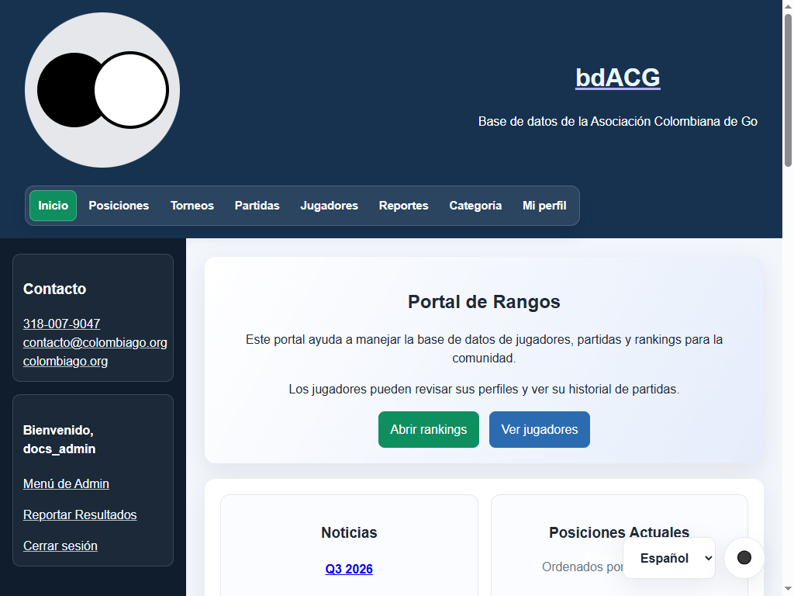</a>

*La página pública ofrece navegación, controles de idioma y tema, posiciones, estadísticas y enlaces al contenido público.*

<a href="screenshots/public-players.png">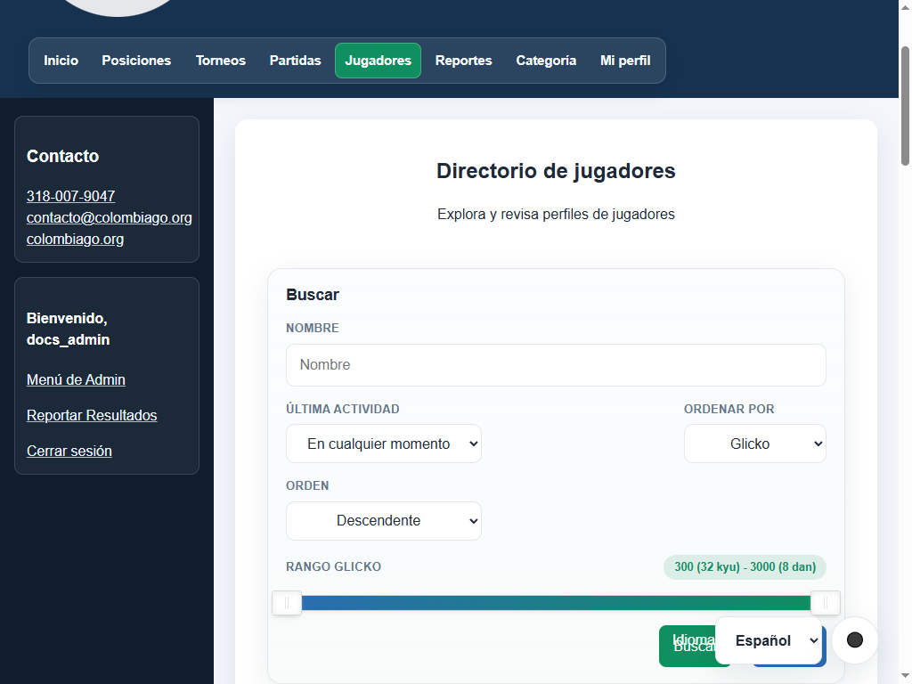</a>

*El directorio permite explorar perfiles y filtrar la lista pública de jugadores.*

Las páginas aceptan `?lang=es`, `?lang=en` o `?lang=pt`; usa `AAAA-MM-DD` en los filtros y campos de fecha.

### Posiciones y directorio de jugadores

- **Posiciones (`/rankings`)**: muestra la tabla de clasificación oficial con rating Glicko-2, desviación de rating (RD), categoría Dan/Kyu calculada, partidas jugadas, porcentaje de victorias, racha reciente y fecha de última actividad. Solo aparecen jugadores activos.
- **Directorio de jugadores (`/players`)**: permite buscar por nombre o apellido, filtrar por rango de rating mínimo y máximo, filtrar por fecha de última actividad y ordenar por cualquier columna con paginación configurable.
- **Perfil del jugador (`/player/view?id=<id>`)**:
  - Resumen de rating actual, RD, volatilidad y categoría.
  - Hitos de carrera: mejor rating histórico, racha más larga, victorias con blancas y con negras.
  - Historial de partidas completo con fecha, color, oponente, resultado, evento y enlace al visor SGF si está disponible.
  - Gráfico interactivo de evolución de rating en el tiempo.
  - Historial de torneos jugados con posición inicial y final.
  - Tabla de enfrentamientos directos (Head-to-Head) contra cada oponente.

<a href="screenshots/public-rankings.png">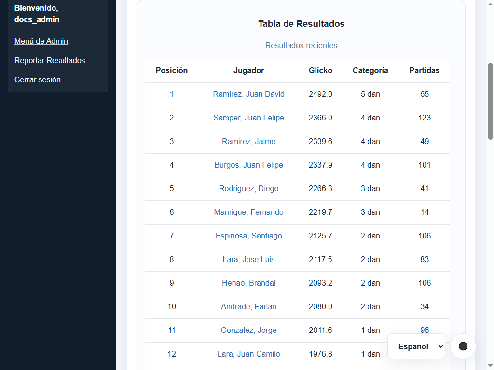</a>

*Tabla de posiciones ordenada por rating con indicadores de categoría y forma reciente.*

<a href="screenshots/public-player-profile.png">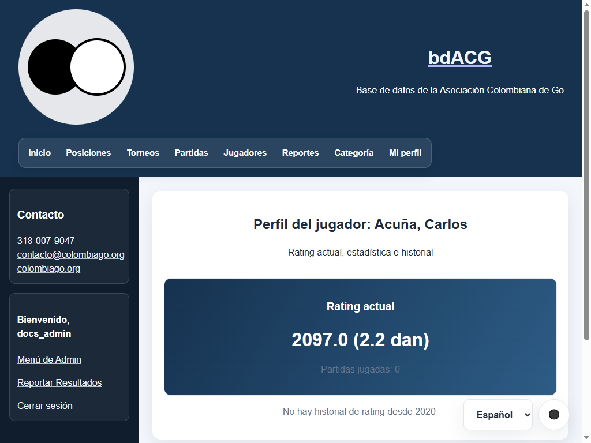</a>

*Perfil público con rating actual, categoría y resumen de actividad del jugador seleccionado.*

### Partidas y visor SGF

- **Lista de partidas (`/matches`)**: consulta el historial global de partidas registradas, con filtros por fecha inicial, fecha final y jugador, además de ordenación por fecha, jugador blanco, jugador negro, resultado o ronda.
- **Visor SGF (`/matches/<id>/record` y `/sgf-library/<filename>`)**: visualiza interactivamente registros SGF mediante el visor BesoGo integrado. Permite reproducir jugadas paso a paso, alternar entre tema Claro (Simple) y Tema Oscuro, y descargar el archivo original mediante el enlace directo (`/matches/<id>/sgf` o `/sgf/<filename>`).

<a href="screenshots/public-matches.png">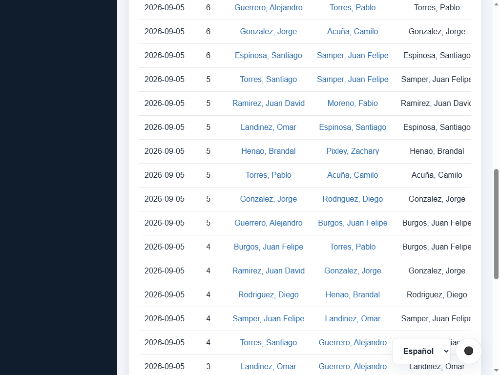</a>

*Lista global de partidas con filtros, enlace a la biblioteca SGF y acciones de visualización.*

<a href="screenshots/public-match-record.png">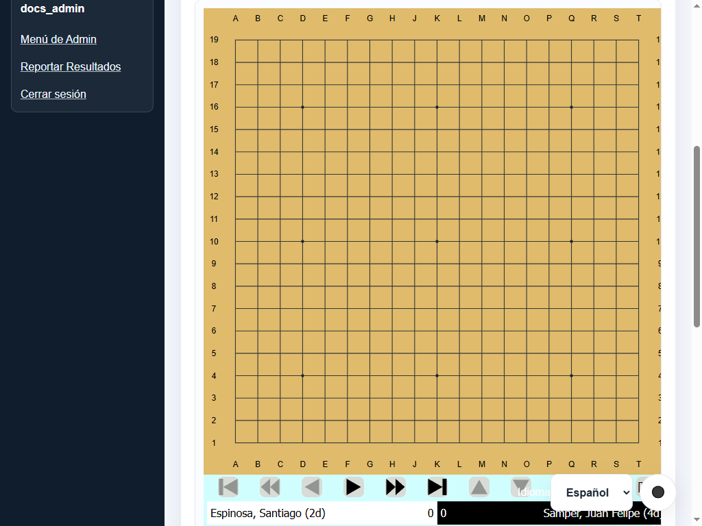</a>

*Visor SGF de una partida vinculada, con controles de reproducción, cambio de tema y descarga.*

### Torneos públicos

- **Lista de torneos (`/tournaments`)**: muestra los torneos activos y finalizados con su fecha, lugar, sistema de juego, número de rondas y estado. Los torneos en estado borrador permanecen ocultos para el público general.
- **Detalle del torneo (`/tournaments/<id>`)**: permite consultar los emparejamientos y resultados mesa por mesa de cada ronda disputada, así como la tabla de posiciones oficial actualizada con puntuación (Pts/MMS), SOS, SOSOS y SODOS.

<a href="screenshots/public-tournaments.png">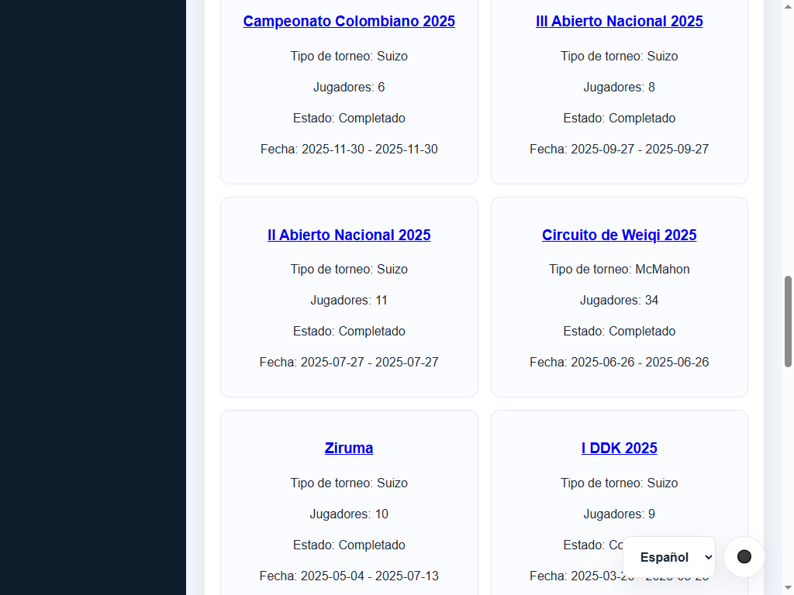</a>

*Listado de torneos públicos con estado, sistema y rondas.*

<a href="screenshots/public-tournament-detail.png">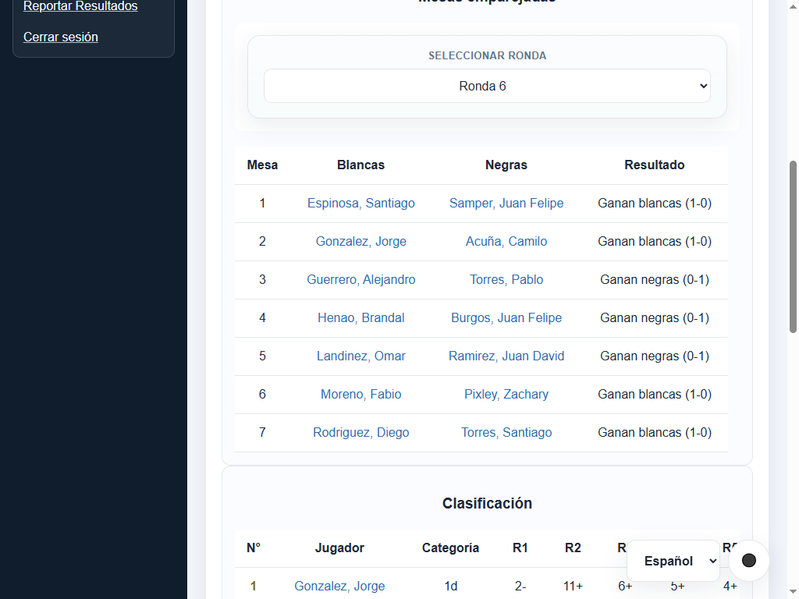</a>

*Detalle de un torneo con selector de ronda, mesas emparejadas, resultados y clasificación.*

### Reportes periódicos y exportación

- **Pantalla de reportes (`/reports`)**: permite analizar el rendimiento de los jugadores en periodos específicos:
  - Periodos predefinidos: *Todo el tiempo*, *Este año*, *Este trimestre*, o *Rango personalizado*.
  - Filtro opcional por jugador específico para ver su balance contra rivales, clubes y países en el periodo seleccionado.
  - Los rangos de fecha `start_date` y `end_date` son inclusivos y se evalúan en la zona horaria fija del servidor (UTC-5).
  - Partidas con fechas o resultados no válidos se excluyen y se contabilizan en el resumen.
- **Exportación CSV (`/reports/export.csv`)**: genera un archivo CSV con la tabla exacta calculada en pantalla, manteniendo los filtros aplicados.
- **Exportación PDF (`/reports/export.pdf`)**: genera un informe PDF formateado con encabezados centrados, fecha del reporte, idioma actual y nombre del jugador y periodo en el archivo.

<a href="screenshots/public-reports.png">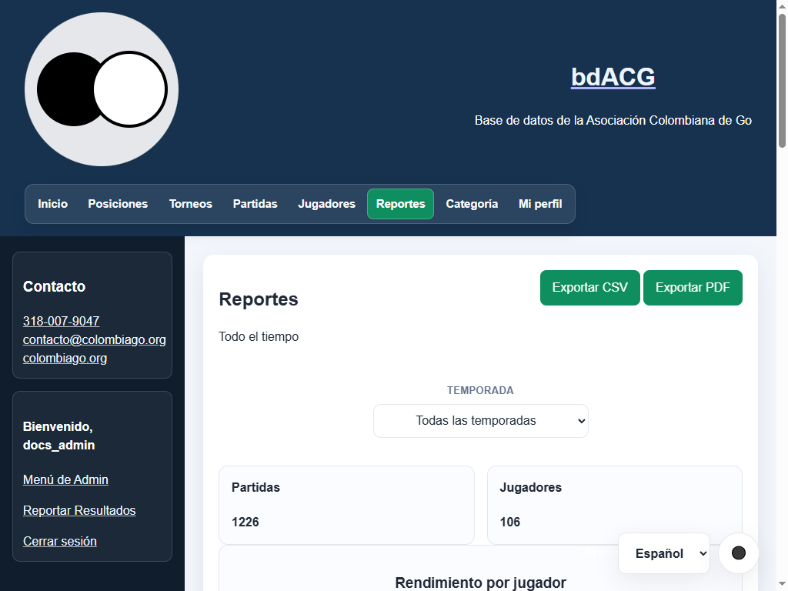</a>

*Pantalla de reportes con filtros por fecha, jugador y opciones de exportación CSV/PDF.*

### Conversor de categoría

La página `/category` convierte un rating Glicko a categoría Dan/Kyu y muestra la fórmula, las constantes configuradas y la escala completa.

<a href="screenshots/public-category.png">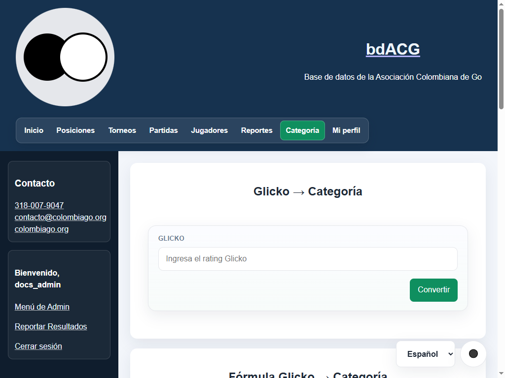</a>

*Conversor de rating a categoría con campo de entrada y botón de cálculo.*

### Noticias públicas

La página `/news/<article_id>` muestra el artículo publicado y transforma las etiquetas de jugadores, torneos y partidas en enlaces relacionados.

<a href="screenshots/public-news-article.png">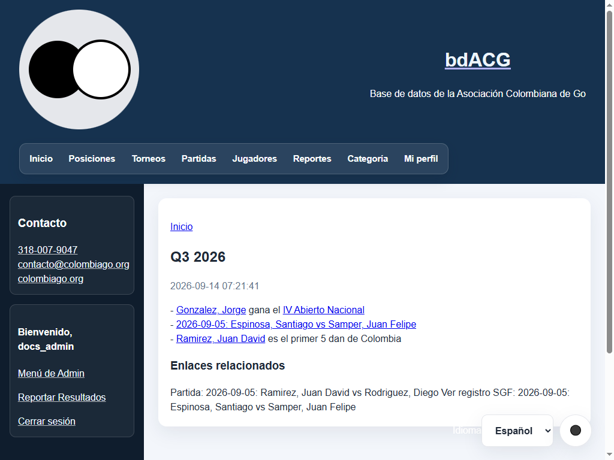</a>

*Artículo publicado con enlaces relacionados a jugadores, torneos y partidas.*

### Biblioteca SGF

La biblioteca pública (`/sgf-library`) contiene los registros de partidas cargados en la plataforma:
- Valida automáticamente el tamaño del archivo, la codificación UTF-8 y la estructura sintáctica SGF.
- Sincroniza metadatos del encabezado SGF (jugadores blanco y negro, rangos, evento, fecha y resultado) con la partida asociada en la base de datos.
- Si un archivo físico desaparece de `uploads/sgf/`, el enlace se limpia de forma automática para evitar enlaces rotos.
- Desvincular un archivo o borrar la partida conserva el registro en la biblioteca; solo los administradores pueden borrar el archivo físico definitivamente.

<a href="screenshots/public-sgf-library.png">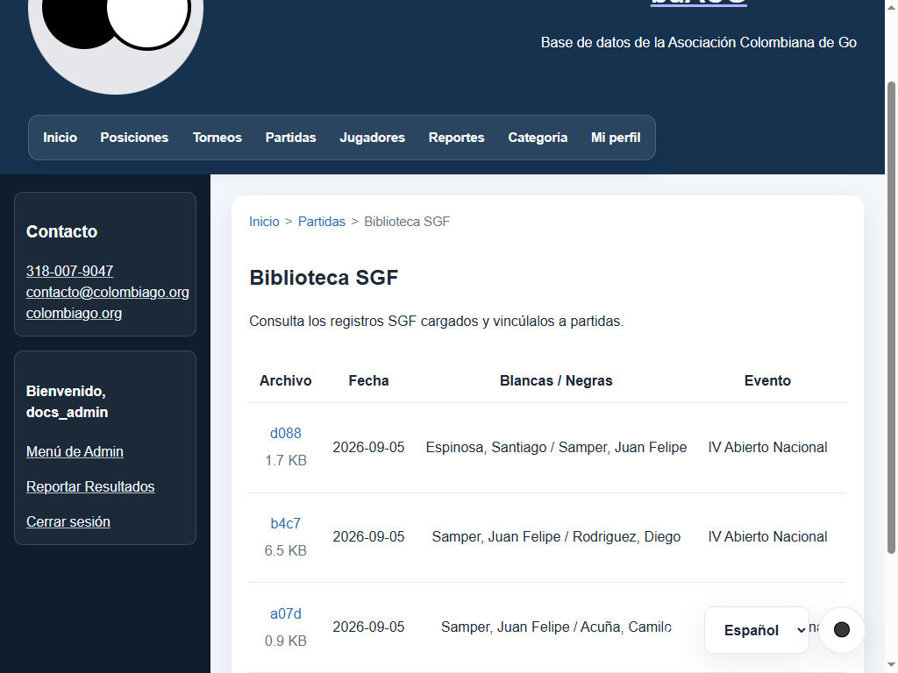</a>

*Biblioteca SGF con metadatos, partidas vinculadas y enlaces al visor.*

*Registro SGF abierto desde la biblioteca, con sus metadatos y controles del visor.*

## Interfaz de miembros

Los jugadores de la comunidad pueden registrar una cuenta personal para gestionar sus preferencias y enviar resultados de torneos o partidas individuales.

### Registro e inicio de sesión

1. Abre `/admin/register` para crear una cuenta proporcionando nombre de usuario, correo electrónico y contraseña (mínimo 8 caracteres). El formulario incluye protección Google reCAPTCHA v3.
2. Las cuentas nuevas reciben automáticamente el rol `member`.
3. Solicita a un administrador u operador que vincule tu cuenta de usuario con tu ficha de jugador en `/admin/users`.
4. Inicia sesión en `/admin/login`.

<a href="screenshots/admin-login.png">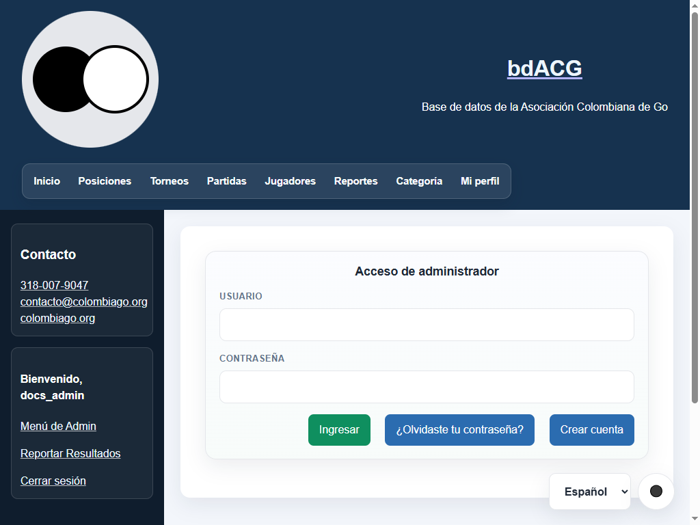</a>

*Formulario de acceso administrativo con enlaces de registro y recuperación.*

<a href="screenshots/admin-register.png">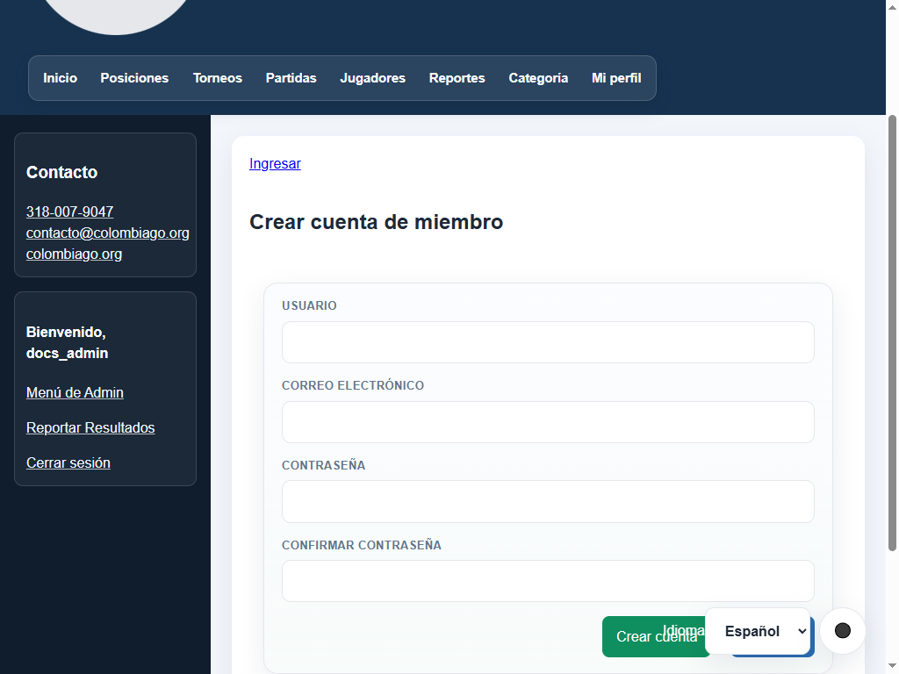</a>

*Registro de una cuenta de miembro con correo y confirmación de contraseña.*

### Gestión de perfil y preferencias

Desde `/admin/profile`, cada usuario autenticado puede:
- Actualizar su dirección de correo electrónico para notificaciones y recuperación.
- Cambiar el idioma preferido de la interfaz (`Español`, `English`, `Português`).
- Alternar entre el tema claro y el tema oscuro.
- Seleccionar su zona horaria IANA con ajuste UTC calculado (por ejemplo, `America/Bogota [UTC-05:00]`, `America/Sao_Paulo`, `Europe/Madrid`).
- Cambiar su contraseña actual ingresando la contraseña anterior y la nueva confirmada.

<a href="screenshots/member-profile.png">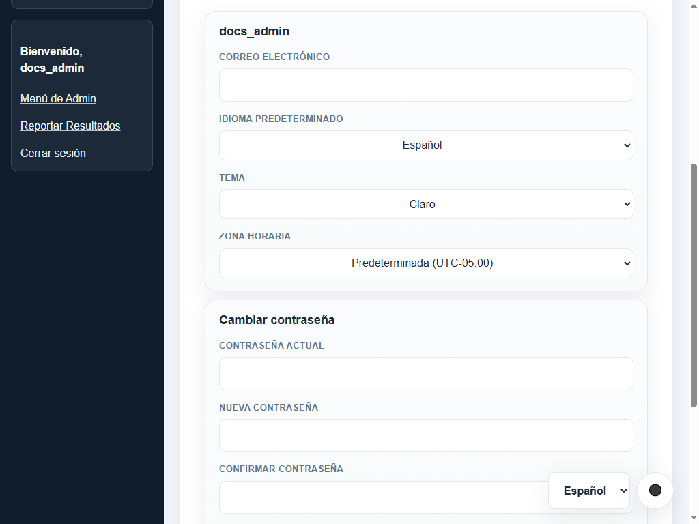</a>

*Pantalla de perfil de usuario para gestionar idioma, tema, zona horaria y contraseña.*

### Recuperación de contraseña

1. Si olvidaste tu contraseña, haz clic en *¿Olvidaste tu contraseña?* en `/admin/login` o ingresa a `/admin/forgot-password`.
2. Ingresa tu correo registrado. Si existe en el sistema, recibirás un enlace de un solo uso con token hash criptográfico.
3. El enlace expira automáticamente según el tiempo configurado (`PASSWORD_RESET_TTL_SECONDS`, por defecto 3600 segundos).
4. Abre el enlace `/admin/reset-password/<token>` e ingresa tu nueva contraseña. Por motivos de seguridad, la respuesta no revela si un correo está registrado o no.

<a href="screenshots/admin-forgot-password.png">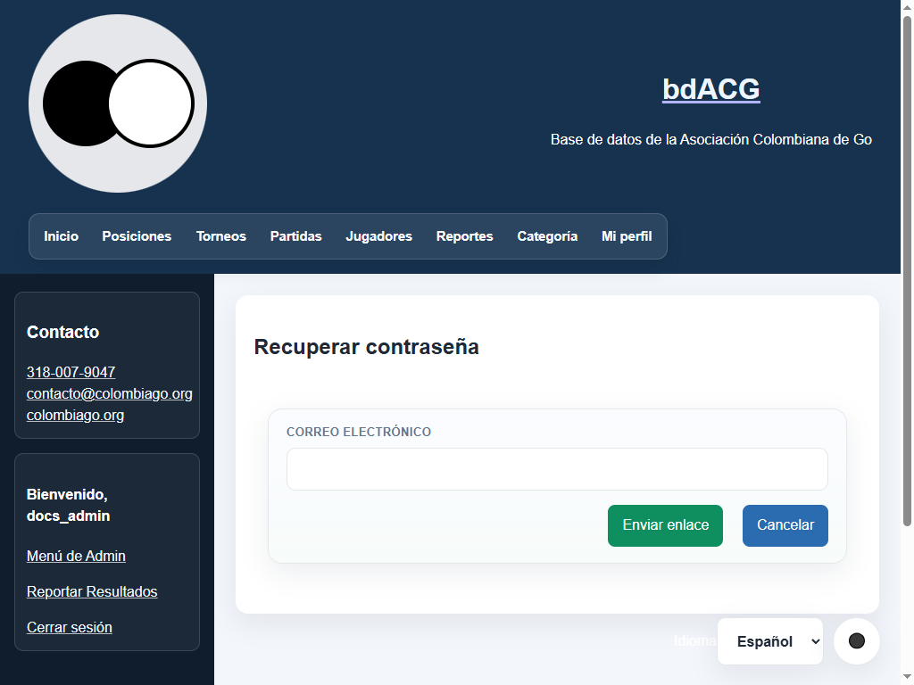</a>

*Solicitud de un enlace de recuperación mediante el correo registrado.*

<a href="screenshots/admin-reset-password.png">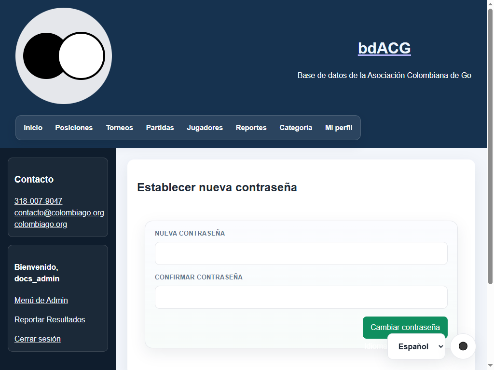</a>

*Formulario para establecer una nueva contraseña a partir de un token.*

### Reportar resultados

Los miembros pueden reportar resultados de partidas en `/admin/report-results`:

1. **Requisito obligatorio**: la cuenta debe estar vinculada a un jugador por un administrador. Si no está vinculada, la interfaz mostrará un aviso informativo.
2. **Formulario de envío**:
    - **Oponente**: selecciona el jugador rival de la lista de jugadores activos.
    - **Color**: indica si jugaste con Blancas o Negras.
    - **Resultado**: indica si ganaron Blancas (`1-0`), ganaron Negras (`0-1`) o Tablas (`1/2-1/2`).
    - **Fecha**: fecha en que se jugó la partida (`AAAA-MM-DD`).
    - **Evento y Lugar**: nombre del torneo o club y ciudad donde se disputó.
    - **Ronda**: número de ronda si corresponde.
    - **Piedras de hándicap**: cantidad de piedras (0 a 9) otorgadas a Negras.
    - **Archivo SGF (opcional)**: carga el archivo `.sgf` con el registro de jugadas.
3. **Estado de envío**: una vez enviada, la partida queda en estado *Pendiente* en la cola de moderación (`/admin/result-submissions`). No afecta rankings, ratings ni reportes públicos hasta que sea revisada y aprobada por el equipo administrativo.

<a href="screenshots/member-report-results.png">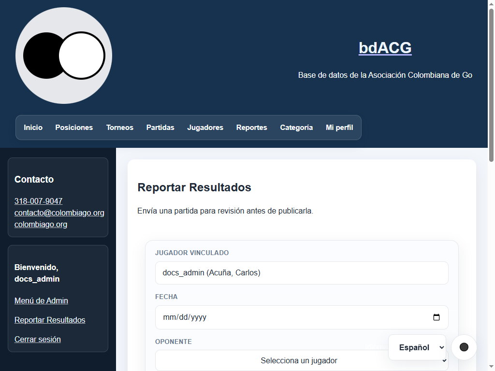</a>

*La pantalla muestra el requisito de vincular un jugador y el área de envíos pendientes.*

## Panel de administración

Inicia sesión en `/admin/login` con una cuenta con rol administrativo. El menú se adapta automáticamente según los permisos asignados:
- `member`: acceso a perfil y reporte de resultados de su jugador vinculado.
- `tournament_director`: gestión completa de torneos (participantes, emparejamientos, rondas, resultados y exportaciones).
- `operator`: todas las funciones de torneos, más gestión de partidas, importación de datos, biblioteca SGF, noticias y moderación de resultados.
- `administrator`: control total de la plataforma, incluyendo jugadores, configuración de ratings/categorías, copias de seguridad, gestión de usuarios, auditoría y parámetros del sistema.

<a href="screenshots/admin-dashboard.png">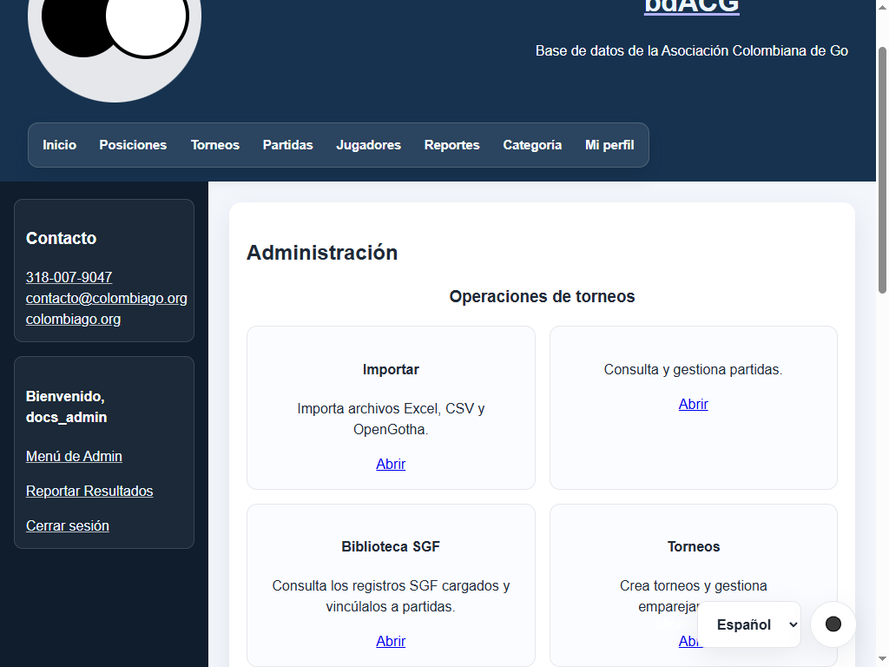</a>

*El panel agrupa los controles en operaciones de torneos, gestión de datos y administración y acceso. Selecciona **Abrir** en una tarjeta para entrar.*

### Gestión de torneos

#### 1. Creación y configuración de torneos (`/admin/tournaments`)

- **Nombre, lugar y fechas**: ingresa el nombre oficial, ciudad/sede, fecha de inicio y fin.
- **Número de rondas**: define la cantidad total de rondas planificadas.
- **Sistema de emparejamiento**:
  - **Suizo estándar (`swiss`)**: empareja jugadores con puntuaciones similares evitando repeticiones de rivales y equilibrando colores.
  - **Suizo por categoría (`swiss_cat`)**: restringe los emparejamientos estrictamente dentro de la misma categoría en las rondas iniciales configuradas.
  - **Suizo acelerado (`accelerated_swiss`)**: divide el torneo en bandas de aceleración según el esquema seleccionado (3 bandas Go o límites de categoría personalizados) durante las rondas indicadas.
  - **McMahon (`mcmahon`)**: asigna puntos iniciales (MMS) según el rango de cada jugador a partir de la Barra McMahon (`mm_bar`), el Piso McMahon (`mm_floor`) y el Cero McMahon (`mm_zero`).
- **Puntuación de descansos y ausencias**:
  - *Puntos por descanso (BYE)*: puntos otorgados al jugador libre cuando el número de participantes es impar (por defecto 1.0 punto).
  - *Puntos por ausencia*: puntos otorgados en partidas no jugadas por ausencia (por defecto 0.0 puntos).
- **Hándicap automático**: habilita o deshabilita la sugerencia automática de piedras de hándicap calculadas por la diferencia de categoría.

<a href="screenshots/admin-tournaments.png">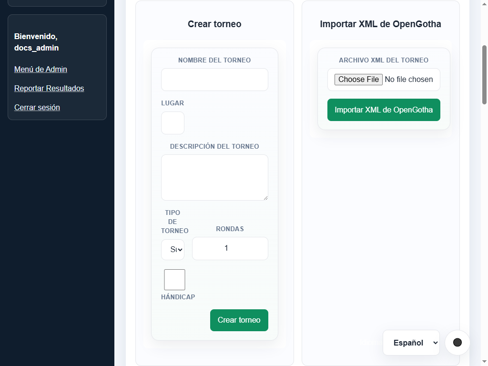</a>

*La página de torneos ofrece controles para crear torneos, seleccionar el sistema de emparejamiento y abrir sus operaciones.*

<a href="screenshots/admin-tournament-settings.png">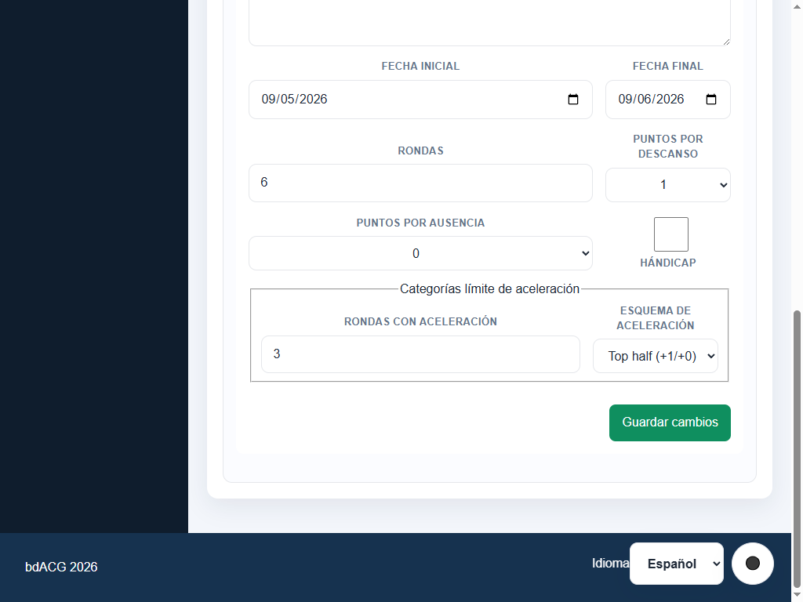</a>

*Ajustes del torneo con fechas, rondas, puntos de BYE/ausencia, hándicap y aceleración.*

#### 2. Gestión de participantes

- **Inscripción de jugadores**: agrega jugadores activos existentes mediante el selector o crea un jugador nuevo directamente desde el torneo.
- **Eliminación de participantes**: retira participantes que no vayan a competir antes de iniciar la primera ronda.
- **Importación OpenGotha XML**: al importar un archivo OpenGotha, los participantes se leen automáticamente junto con su rango, grado y rating inicial. Si algún nombre tiene similitud con un jugador existente en la base de datos, el asistente muestra una sugerencia interactiva para vincularlo inmediatamente, crear un jugador nuevo o descartarlo.

<a href="screenshots/admin-tournament-players.png">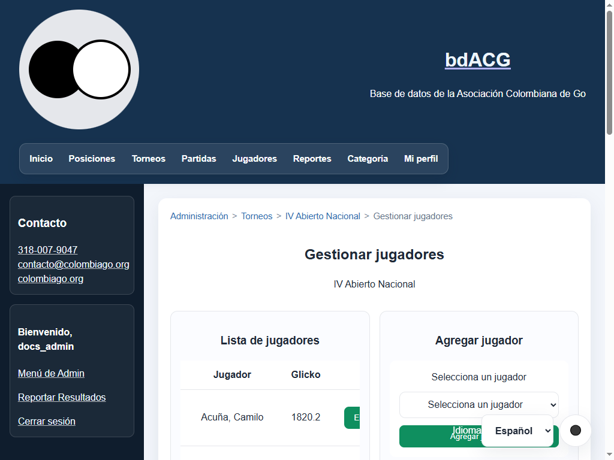</a>

*Gestión de participantes con lista actual, selector de jugadores existentes y creación de jugadores pendientes.*

#### 3. Emparejamientos, rondas y registro de resultados

- **Generar ronda**: el algoritmo empareja automáticamente a los participantes respetando el sistema elegido, evitando enfrentamientos previos y alternando los colores blanco y negro.
- **Manejo de descansos (BYE)**: si el número de jugadores es impar, se asigna un BYE automático. El sistema registra el historial para no repetir el descanso en un jugador mientras otros participantes no lo hayan recibido.
- **Emparejamiento manual y asistido**:
  - *Emparejar seleccionados*: selecciona dos jugadores libres y pulsa *Emparejar seleccionados*.
  - *Desemparejar*: libera una mesa específica o usa *Desemparejar todo* para rehacer la ronda.
- **Ajuste de hándicap por mesa**: cada mesa muestra la sugerencia de piedras de hándicap calculada automáticamente; el director puede modificar las piedras antes de ingresar el resultado.
- **Registro de resultados (ciclo de 7 estados)**: haz clic en el nombre del ganador o sobre el texto del resultado. El estado avanza en el siguiente orden:
  1. `-` : Sin resultado (pendiente de juego).
  2. `1-0` : Victoria de Blancas.
  3. `1/2-1/2` : Tablas / Empate.
  4. `0-1` : Victoria de Negras.
  5. `1-!0` : Victoria de Blancas por inasistencia de Negras.
  6. `!0-1` : Victoria de Negras por inasistencia de Blancas.
  7. `!0-0` : Inasistencia de ambos jugadores (doble derrota).
  *Hacer clic nuevamente sobre el ganador seleccionado borra el resultado y lo regresa a pendiente (`-`).*

<a href="screenshots/admin-tournament-detail.png">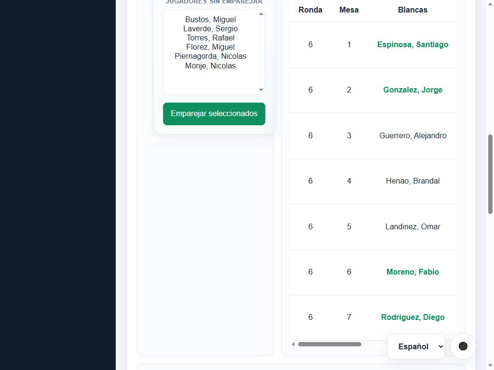</a>

*Panel de control de ronda de torneo: emparejamientos, mesas, selector de resultados y clasificación.*

#### 4. Procesamiento de rondas y cálculo de rating

- **Procesar ronda (`Procesar ronda`)**:
  - Materializa automáticamente los resultados jugados (`1-0`, `1/2-1/2`, `0-1`) en la tabla oficial de partidas del sistema.
  - Las ausencias (`1-!0`, `!0-1`, `!0-0`) se conservan exclusivamente para la clasificación del torneo y **nunca** afectan los ratings oficiales ni los perfiles de los jugadores.
  - Aplica el ajuste logarítmico de hándicap por cada piedra si la partida fue con hándicap, modificando el rating efectivo únicamente para ese cálculo.
  - Dispara el recálculo incremental de ratings respetando la fecha y el número de ronda en orden cronológico.
- **Clasificación y desempates**: las posiciones son estrictamente secuenciales y únicas. Los empates en puntos o MMS se resuelven de forma determinista mediante SOS, SOSOS, SODOS, rating base y orden alfabético.
- **Orden y migraciones**: dentro de un mismo día, los ratings respetan la ronda y luego el orden de inserción. Las notas de ronda se guardan como enteros cuando es posible; las rondas desconocidas usan la ronda 1. Las tablas de torneos se migran automáticamente al iniciar.
- **Ciclo de vida del torneo**:
  - *Borrador (`draft`)*: oculto del portal público para preparación previa.
  - *Activo (`active`)*: visible en el portal público con emparejamientos y resultados en tiempo real.
  - *Completado (`completed`)*: torneo cerrado con posiciones finales oficiales.
  - *Cancelado (`canceled`)*: cancelado sin efecto en ratings.
- **Exportación**: descarga los resultados del torneo en formatos compatibles para informes o software externo.

### Gestión de datos

#### 1. Asistente de importación con vista previa (`/admin/import`)

Permite cargar datos históricos o torneos masivos:
- **Formatos aceptados**:
  - Libro Excel (`.xlsx` o `.xls`): importa el conjunto completo de jugadores y partidas reemplazando los datos actuales.
  - XML de OpenGotha (`.xml`): importa metadatos del torneo, jugadores, partidas y piedras de hándicap.
  - Archivo CSV (`.csv`): columnas `date`, `white`, `black`, `result` y opcional `handicap` (0 a 9).
- Crea una copia de seguridad antes de importar un libro que reemplace los datos activos.
- **Reconciliación explícita de jugadores**:
  - La vista previa clasifica cada registro como *Coincidencia exacta*, *Sugerencia difusa*, *Jugador nuevo* o *Duplicado*.
  - El operador puede decidir por cada jugador: vincular al existente, crear nuevo o rechazar la fila.
  - Permite editar metadatos del torneo antes de confirmar la importación.
  - Un error de validación en CSV cancela toda la operación sin dejar cambios parciales.

<a href="screenshots/admin-import.png">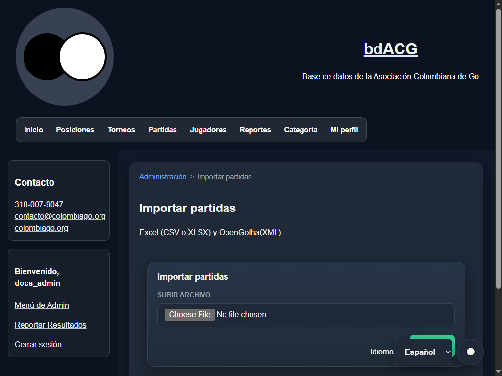</a>

*La pantalla usa el selector de archivos para elegir un archivo Excel, CSV u OpenGotha y **Importar** para iniciar la vista previa y reconciliación.*

<a href="screenshots/admin-import-preview.png">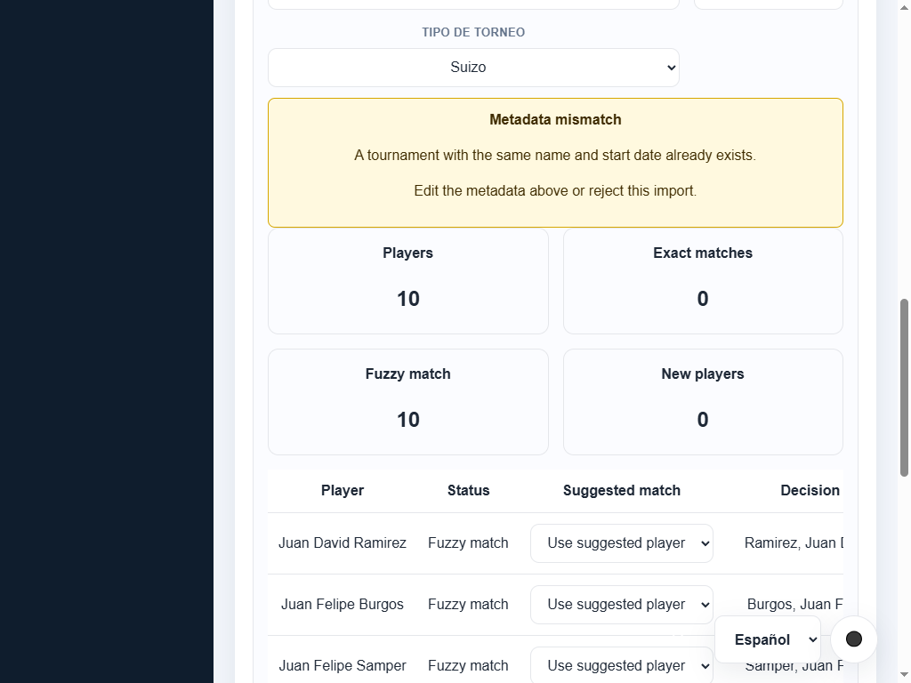</a>

*Vista previa de OpenGotha con metadatos editables, resumen de coincidencias y decisiones por jugador.*

#### 2. Administración de jugadores (`/admin/players`)

- Filtra por nombre, rango de rating y estado.
- **Edición (`/admin/players/edit?id=<id>`)**: modifica nombre, apellido, nombre para mostrar, rating inicial, RD inicial y activa o desactiva al jugador. Los jugadores inactivos se excluyen automáticamente de clasificaciones y emparejamientos.
- **Eliminación**: modal de confirmación seguro que advierte sobre la eliminación del historial y partidas vinculadas.

<a href="screenshots/admin-players.png">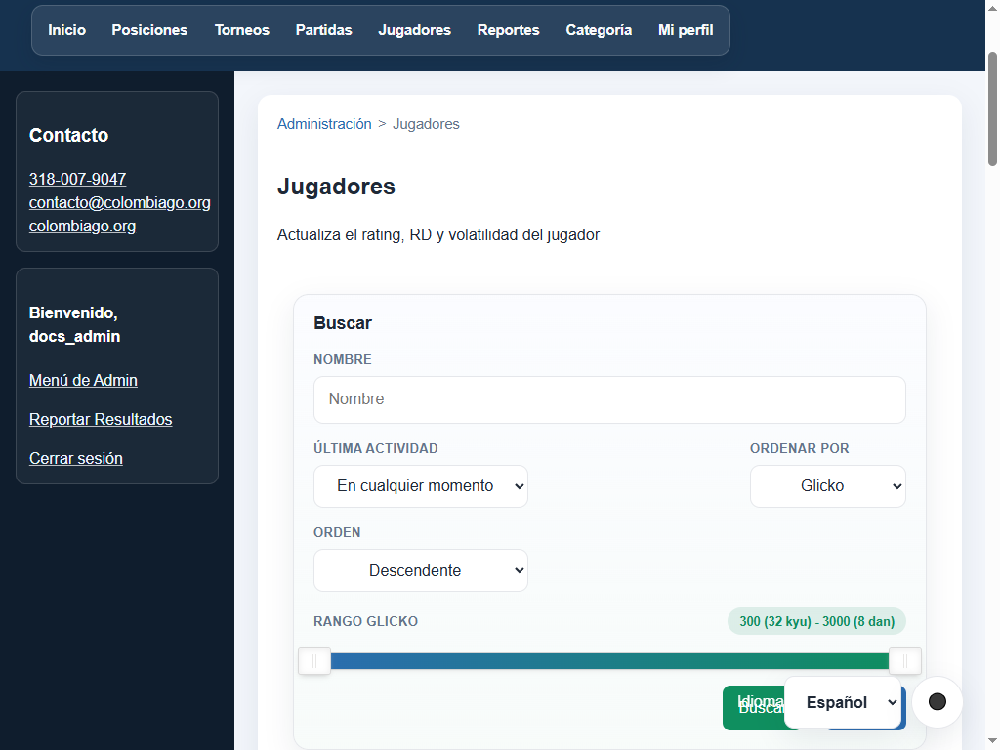</a>

*Lista administrativa con filtros, rango Glicko, estado y accesos de edición.*

<a href="screenshots/admin-edit-player.png">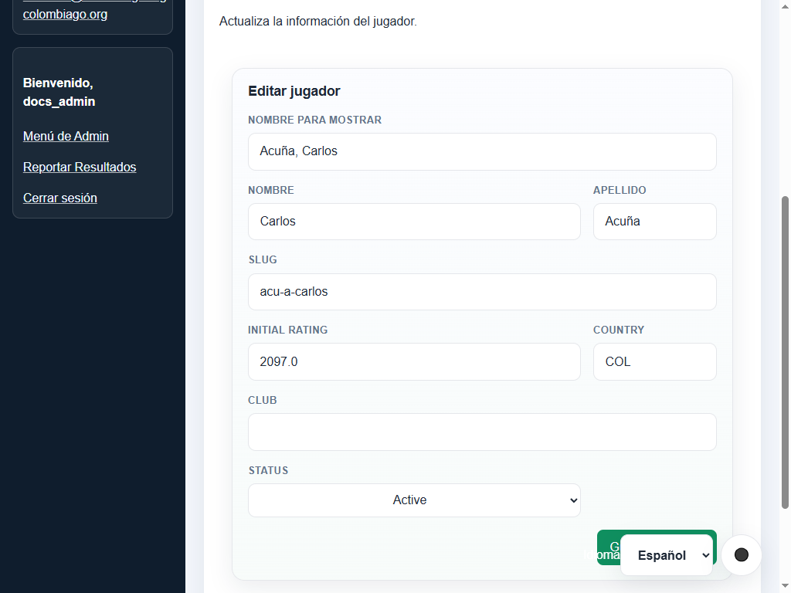</a>

*Formulario de edición de un jugador con nombre, rating inicial, club, país y estado activo.*

#### 3. Administración de partidas (`/admin/matches`)

- Visualiza todas las partidas con paginación, filtros de fecha y jugador, y ordenación configurable.
- **Añadir partida (`/admin/matches/add`)**: formulario con validación estricta de fecha (`AAAA-MM-DD`), jugadores distintos existentes, resultado válido (`1-0`, `0-1`, `1/2-1/2`), piedras de hándicap (0-9) y carga opcional de SGF.
- **Editar partida (`/admin/matches/edit?id=<id>`)**: permite corregir jugadores, fecha, resultado o notas de ronda.
- Al materializar resultados de torneo, `event` conserva el nombre del torneo y `notes` (visible como `Round`) guarda la ronda como entero. Los valores antiguos se convierten cuando contienen un número; los textos sin número se conservan y se tratan como ronda 0.
- **Vincular y desvincular SGF**: vincula archivos SGF de la biblioteca o sube nuevos registros sincronizados.

<a href="screenshots/admin-match-form-add.png">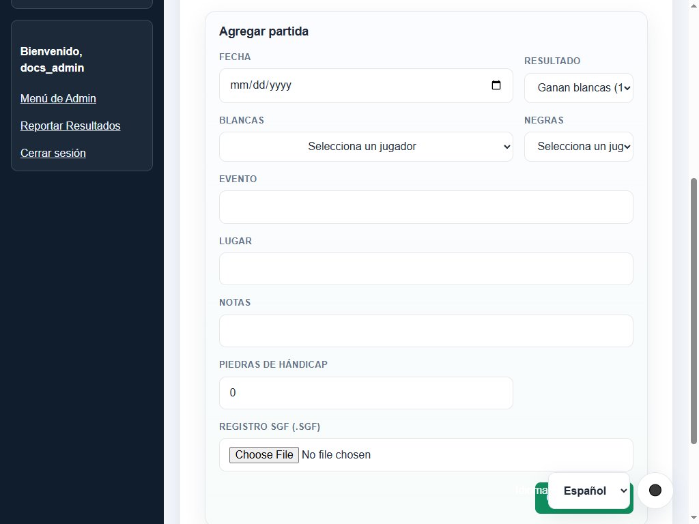</a>

*Formulario de alta de partida con jugadores, resultado, fecha, ronda, hándicap y SGF opcional.*

<a href="screenshots/admin-match-form-edit.png">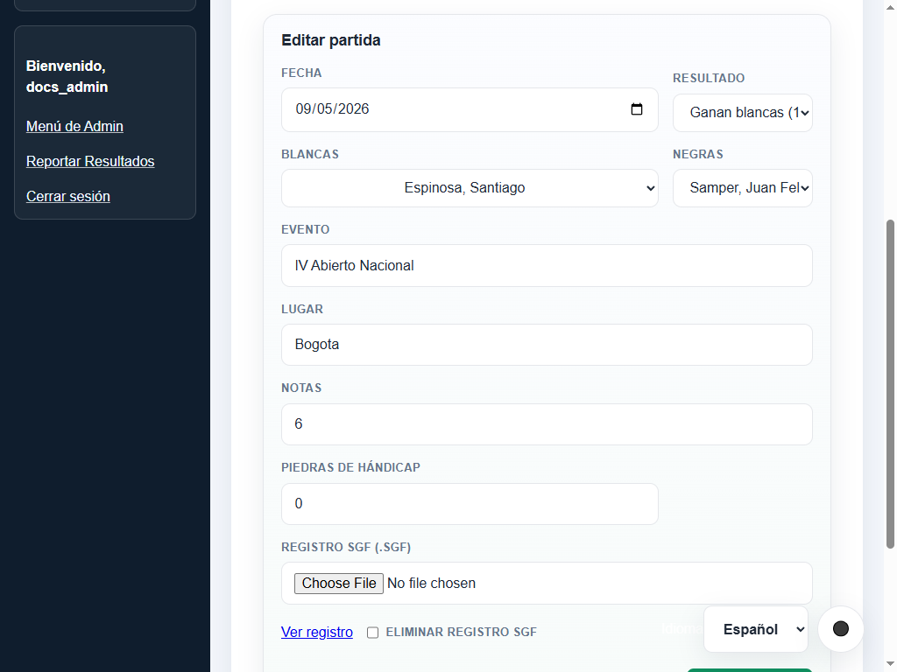</a>

*Formulario de edición precargado para corregir una partida existente.*

<a href="screenshots/admin-matches.png">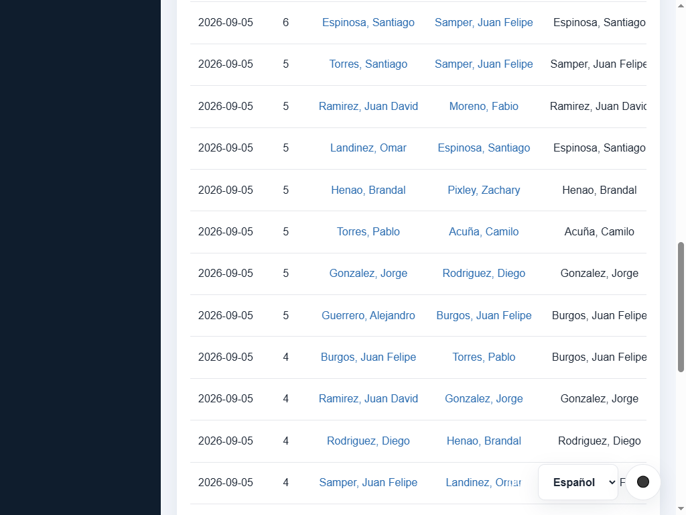</a>

*Tabla de partidas con filtros por fecha, jugador y opciones de edición, borrado y gestión SGF.*

#### 4. Configuración de ratings y categorías (`/admin/ratings` y `/admin/categories`)

- **Parámetros Glicko-2**:
  - Rating inicial por defecto (ej. 1500).
  - Desviación de rating inicial (RD, ej. 350).
  - Volatilidad inicial ($\sigma$, ej. 0.06).
  - Constante de cambio en el tiempo ($\tau$, ej. 0.5).
- **Conversión de categorías Dan/Kyu**:
  - Constante de escala $k$ y desplazamiento $m$.
  - Límites mínimos y umbrales por nivel Dan y Kyu.
- **Recálculo de ratings**:
  - *Recálculo completo*: procesa todo el historial cronológicamente por fecha, ronda y mesa.
  - *Actualización incremental*: recalcula únicamente a partir de la fecha modificada (*dirty date*).

<a href="screenshots/admin-ratings.png">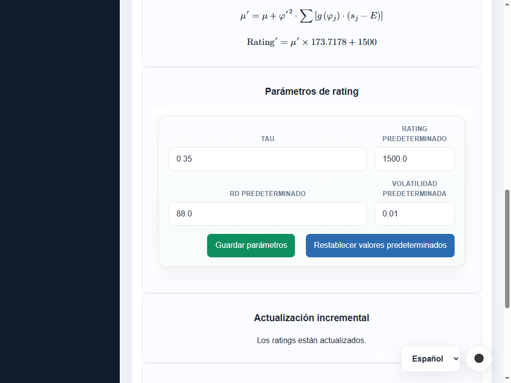</a>

*Panel de ratings con parámetros Glicko-2, conteos del historial y acciones de recálculo.*

<a href="screenshots/admin-categories.png">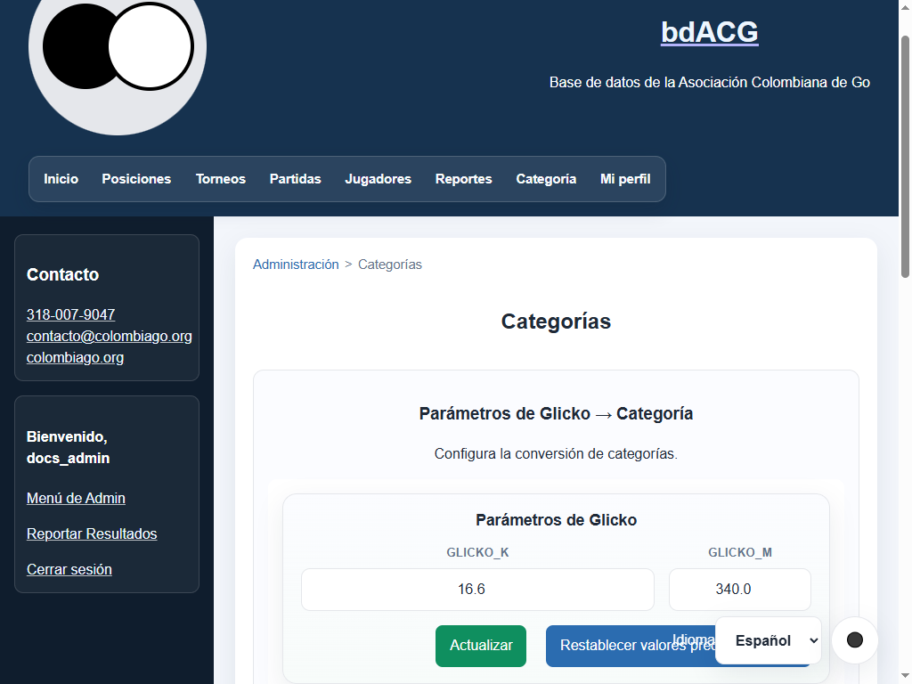</a>

*Configuración de la fórmula Dan/Kyu y vista previa de cambios de categoría.*

#### 5. Moderación de resultados (`/admin/result-submissions`)

- Revisa las partidas enviadas por los miembros de la comunidad.
- Visualiza el detalle completo: jugador que envía, oponente, colores, resultado, fecha, hándicap y visor del SGF adjunto.
- **Aprobar**: materializa la partida en la base de datos oficial y actualiza los ratings automáticamente.
- **Rechazar**: descarta el envío permitiendo registrar una nota de revisión visible para auditoría.

<a href="screenshots/admin-result-submissions.png">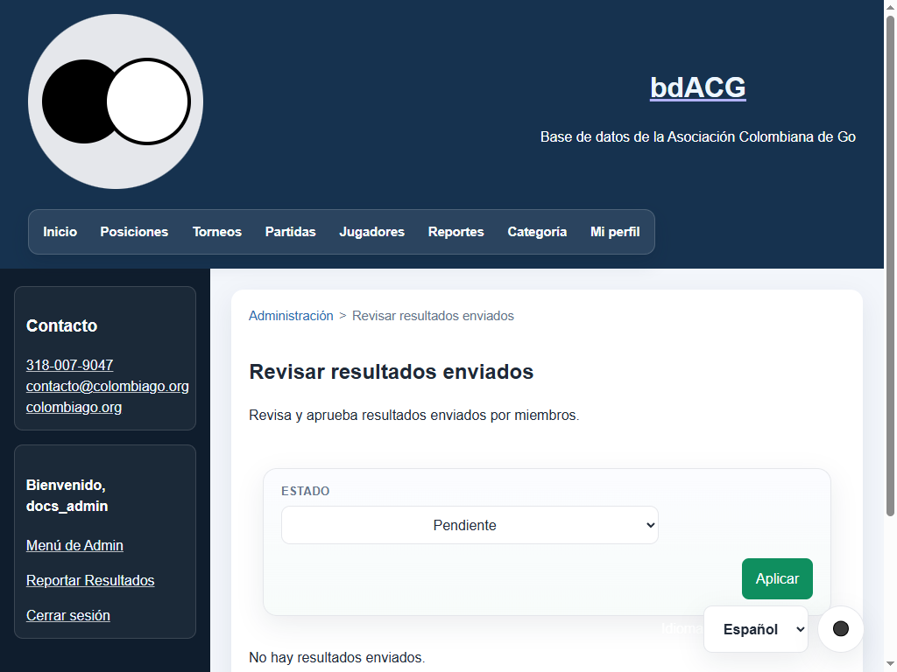</a>

*Cola de moderación con filtro de estado, detalle de partidas y acciones de aprobar o rechazar.*

### Tareas administrativas y de seguridad

#### 1. Copias de seguridad y restauración (`/admin/backups`)

- **Crear copia**: genera una copia de seguridad SQLite con nombre seguro y fecha en `backups/`, incluyendo la carpeta auxiliar de archivos SGF.
- **Restaurar copia**:
  - Restaura la base de datos seleccionada aplicando automáticamente las migraciones pendientes de esquema.
  - Reconstruye los artefactos y el índice de búsqueda de texto completo FTS5 (`players_fts`).
  - Restaura la biblioteca SGF preservando los enlaces existentes.
  - Bloquea el uso de archivos temporales de `data/` como origen de restauración.
- **Eliminar copias**: elimina copias de seguridad obsoletas para liberar almacenamiento.
- Ejecuta `python scripts/check_legacy_players_state.py` para auditar la base activa y las copias administradas.

<a href="screenshots/admin-backups.png">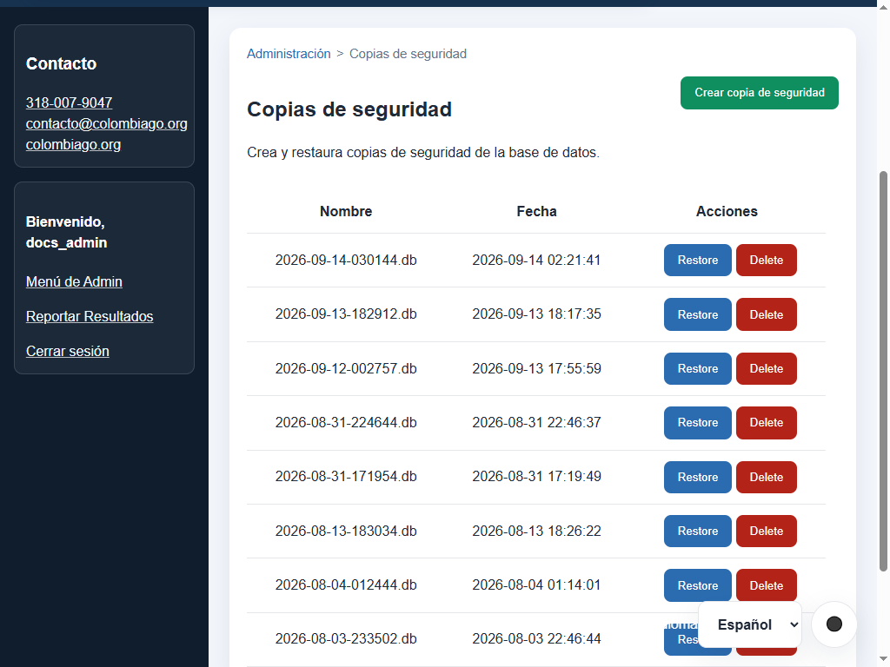</a>

*Lista de copias con acciones de crear, restaurar y eliminar.*

#### 2. Gestión de usuarios (`/admin/users`)

- Crea y edita cuentas de usuario con roles (`administrator`, `operator`, `tournament_director`, `member`).
- Vincula cuentas a jugadores de la base de datos para habilitar el reporte de resultados.
- Asigna zonas horarias individuales a cada cuenta.
- Activa o desactiva cuentas de usuario.

<a href="screenshots/admin-users.png">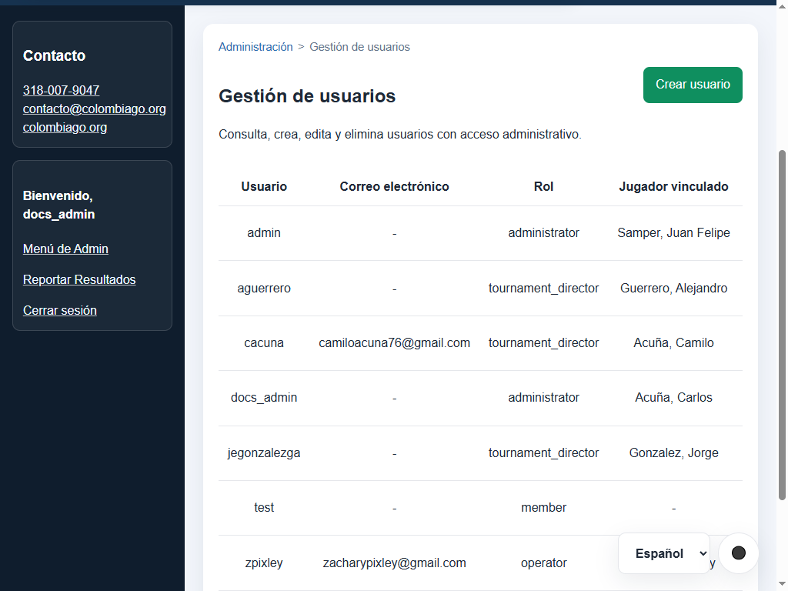</a>

*Lista de cuentas con rol, jugador vinculado, zona horaria, estado y acciones.*

<a href="screenshots/admin-create-user.png">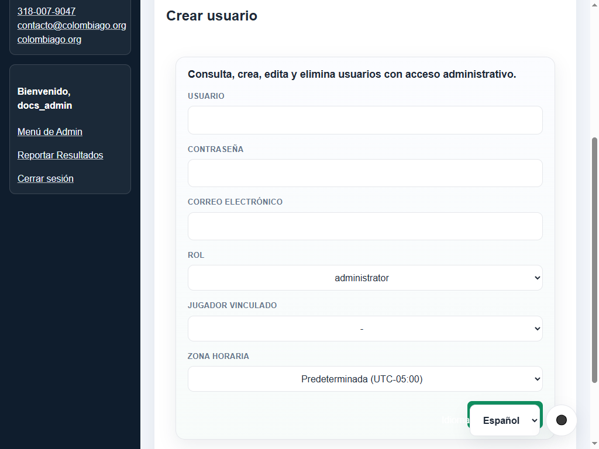</a>

*Formulario para crear una cuenta y asignar rol, jugador vinculado y zona horaria.*

<a href="screenshots/admin-edit-user.png">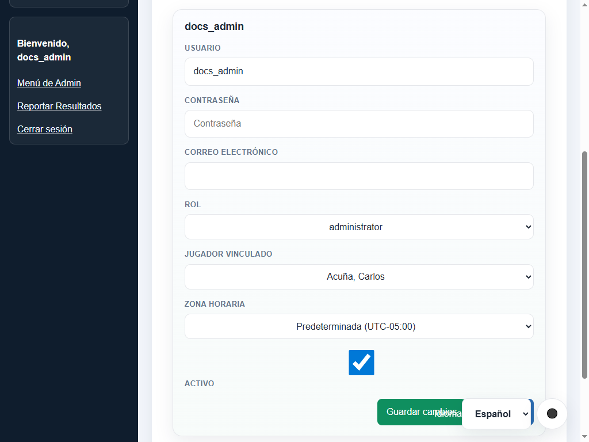</a>

*Edición de `docs_admin`, mostrando el vínculo con el jugador Acuña, Carlos y los permisos de la cuenta.*

#### 3. Publicación de noticias (`/admin/news`)

- Redacta noticias con título, cuerpo de texto y estado de publicación (Borrador o Publicada).
- Inserta etiquetas inteligentes en el texto: `[player:12]`, `[tournament:5]`, `[match:104]`, que la vista pública transforma automáticamente en enlaces y accesos directos al visor SGF.

<a href="screenshots/admin-news.png">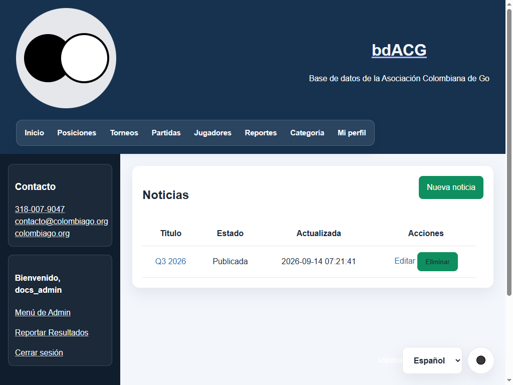</a>

*Lista de noticias con estado de publicación, fecha de actualización y acciones.*

<a href="screenshots/admin-news-form.png">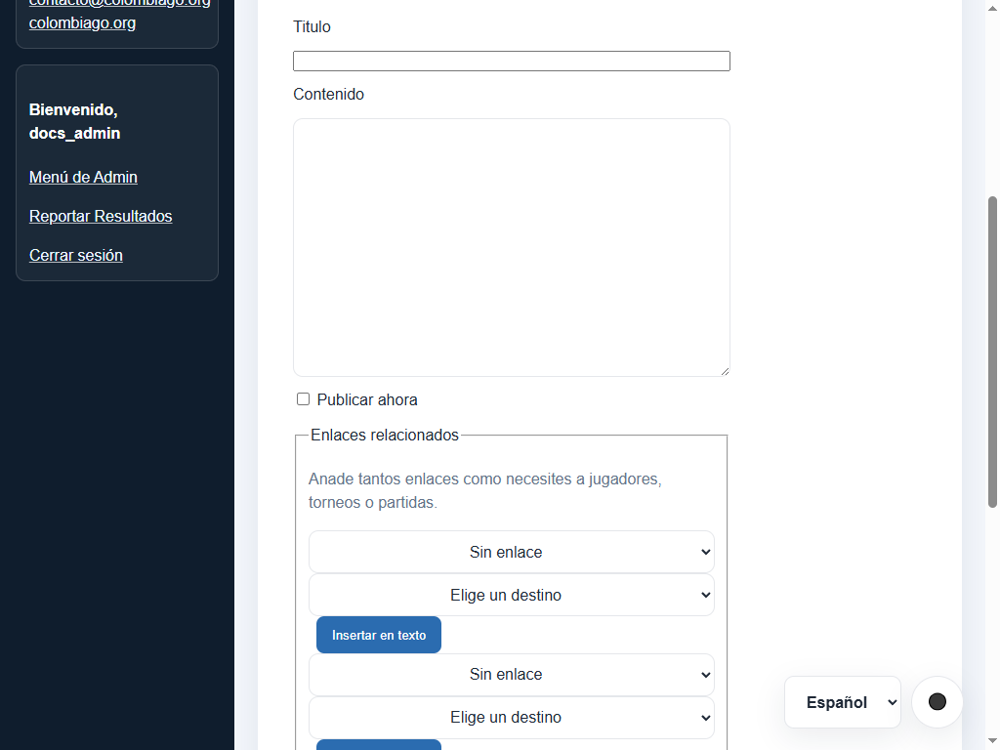</a>

*Formulario de nueva noticia con publicación inmediata y enlaces inteligentes.*

<a href="screenshots/admin-news-edit.png">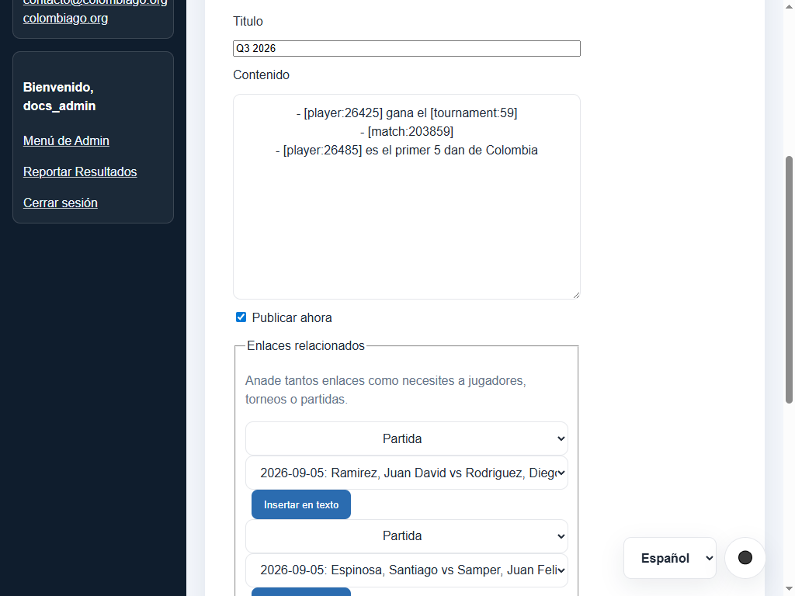</a>

*Formulario precargado para editar el cuerpo, estado y enlaces relacionados de una noticia.*

#### 4. Registro y revisión de auditoría (`/admin/audit`)

- Registra todas las acciones administrativas que modifican el estado del sistema: importaciones, creación/edición de torneos, resultados, altas/bajas de jugadores, partidas, cambios de rating/categorías, gestión de usuarios y copias de seguridad.
- Filtra por usuario actor, tipo de acción, búsqueda libre de texto y rango de fechas.
- Cada evento almacena un resumen JSON compacto limitado a 2 KiB.
- Los eventos con más de 730 días se depuran automáticamente según el parámetro `AUDIT_RETENTION_DAYS`.

<a href="screenshots/admin-audit.png">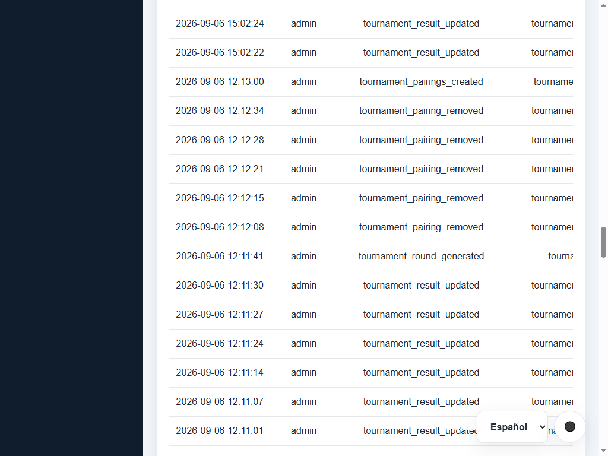</a>

*Registro de auditoría administrativa con filtros por usuario, categoría de acción y fechas.*

#### 5. Configuración de seguridad de la aplicación (`/admin/settings`)

- Ajusta el número máximo de intentos fallidos de inicio de sesión antes de bloquear la IP.
- Define la ventana de tiempo para la limitación de tasa (en segundos).
- Configura el tiempo de vida (TTL) de los enlaces de recuperación de contraseña.
- Botón de restauración para restablecer los valores por defecto definidos en `config.py`.

<a href="screenshots/admin-settings.png">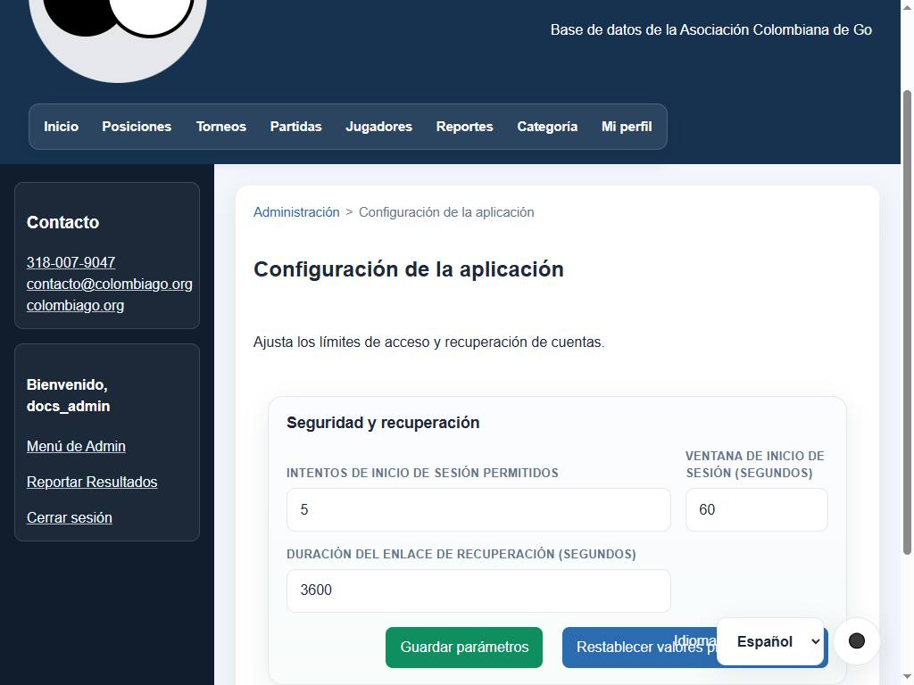</a>

*Parámetros administrativos de intentos de acceso, ventana de limitación y TTL de recuperación.*

### Guía de solución de problemas

1. **Acceso denegado (403)**: verifica que tu cuenta tenga asignado el rol requerido (`tournament_director`, `operator` o `administrator`) para la sección que intentas abrir.
2. **No puedo enviar resultados como miembro**: confirma en `/admin/users` que tu cuenta esté vinculada a una ficha de jugador activa.
3. **Errores al importar archivos**:
   - Verifica que el CSV use codificación UTF-8 y contenga las columnas obligatorias `date`, `white`, `black`, `result`.
   - Asegúrate de que las fechas tengan el formato `AAAA-MM-DD` y los resultados sean exclusivamente `1-0`, `0-1` o `1/2-1/2`.
   - Comprueba que el hándicap esté en el rango de 0 a 9 piedras.
4. **Archivos SGF no encontrados**: si un archivo SGF desaparece físicamente, la aplicación limpia automáticamente el enlace para no interrumpir la navegación. Vuelve a subir el archivo desde `/admin/matches` o la biblioteca SGF.
5. **Restauración de base de datos**: tras restaurar una copia, el sistema ejecuta las migraciones pendientes y reconstruye el índice FTS5 antes de aceptar peticiones.
6. **Seguridad en producción**: mantén siempre variables secretas (`APP_SECRET_KEY`, `ADMIN_PASSWORD`, credenciales SMTP y claves reCAPTCHA) configuradas en el entorno del servidor y nunca en el repositorio de código.
